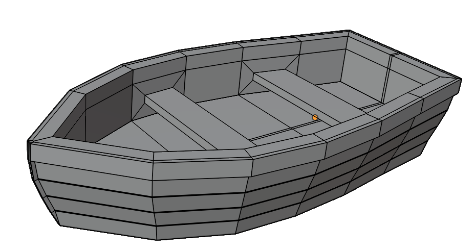
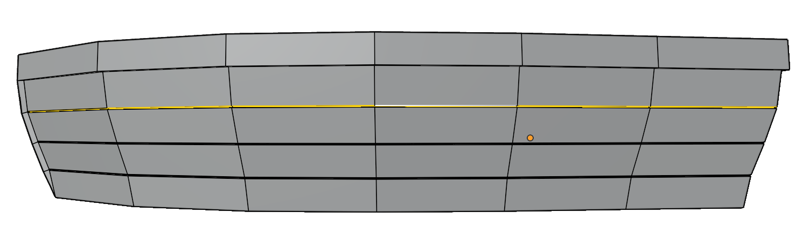
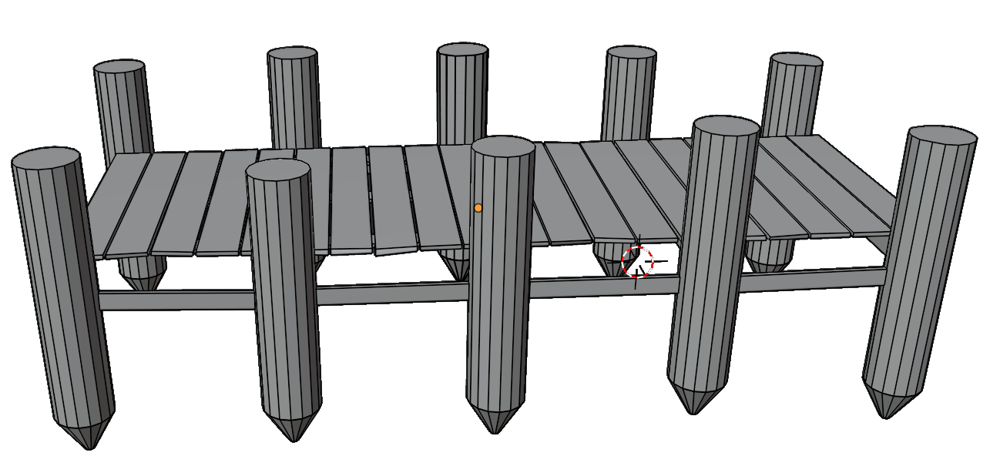
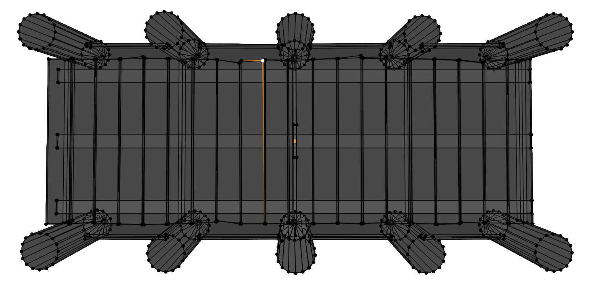
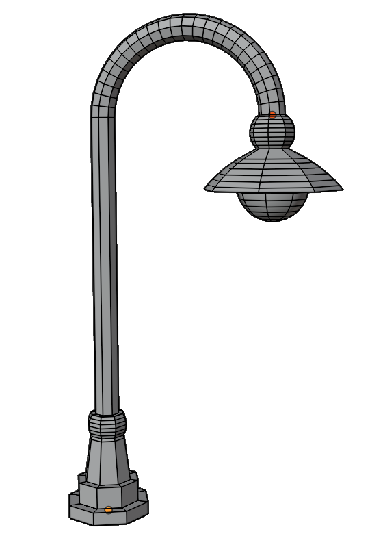
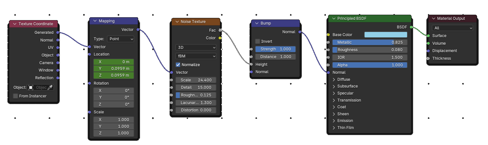

# Blender Dock Scene

A simple animated 3D scene created in **Blender**, featuring a wooden dock, a small boat, animated water, and lamppost lighting. This project was developed as part of the *Introduction to Computer Graphics* course at Alpen-Adria Universität Klagenfurt.

## Overview

The scene represents a calm dock environment:

* A **wooden dock** built from modular pillars and planks
* A **low‑poly boat** gently animated to match water movement
* An **animated water plane** using procedural textures
* **Lampposts** with emission materials, spotlights, and post‑processing glare
* An **HDRI sky** and sunlight for global illumination

The focus of the project is on understanding Blender’s modeling, texturing, animation, and lighting workflows rather than high realism.

## Scene Objects

### Boat

* Modeled from a basic cube using proportional scaling
* Refined in *Edit Mode* with extrusion, inset faces, loop cuts, bevels, and bridging
* Animated by rotating along the Z‑axis to synchronize with water movement

### Dock

* Constructed from repeated pillars (cylinders) and wooden planks
* Slight vertex distortion applied in wireframe mode for realism
* Uses an image‑based wooden texture (albedo, normal, roughness)
* UVs generated using *Smart UV Project* for consistent texture stretching

### Water

* Single plane with a procedural **noise texture** and bump mapping
* Animated via Mapping node on Y and Z axes to simulate waves
* Animation loop created using the Graph Editor with *Repeat Mirrored* modifiers

### Lampposts

* Modeled from cylinders using extrusion and scaling
* Curved arm created with the *Spin* tool
* Light bulb uses an **Emission** material
* Additional spotlights added for enhanced illumination
* Glare effect applied in the Compositor

## Textures

* Wooden dock texture uses three image maps:

  * **Albedo**
  * **Normal**
  * **Roughness**
  * 

## Animation

* Total frames: **200**
* Water animation defined between frames 1–50 and looped using the Graph Editor
* Boat rotation keyframes synchronized with water motion
* Final animation optimized by rendering at **50% X‑axis resolution** to reduce render time

## Lighting & Rendering

* HDRI background for ambient lighting
* Sun lamp for directional light
* Emission materials and spotlights for lampposts
* Glossy reflections disabled on water to avoid unwanted light artifacts

## Known Issues & Limitations

* Some tutorials referenced older Blender versions, requiring workflow adjustments
* Musgrave texture replaced with Noise texture due to Blender updates
* Lighting reflections on water required manual visibility tweaks

## Requirements

* **Blender 3.x or newer** (tested with newer versions than some referenced tutorials)

## Credits & References

This project was created by **Antonio Pirani** as an academic assignment.

Tutorials and resources used include:

* Grant Abbitt – Blender Bloom & Compositing
* Toby Rawal – Procedural Water Material
* TenTech – Low Poly Boat Tutorial
* Winglett Entertainment – Wharf & Wood Texturing
* Oliver Villar – *Learning Blender*
* Poly Haven – HDRI environment

Full references are available in the original project report.

## License

This project is intended for **educational purposes only**. Assets and HDRI files are subject to their respective licenses.
